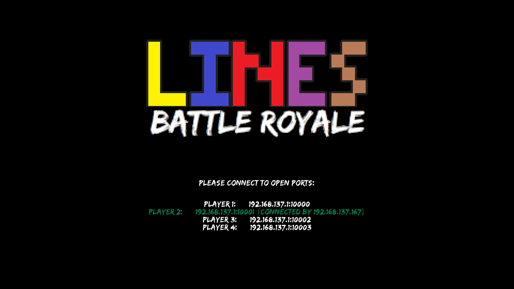
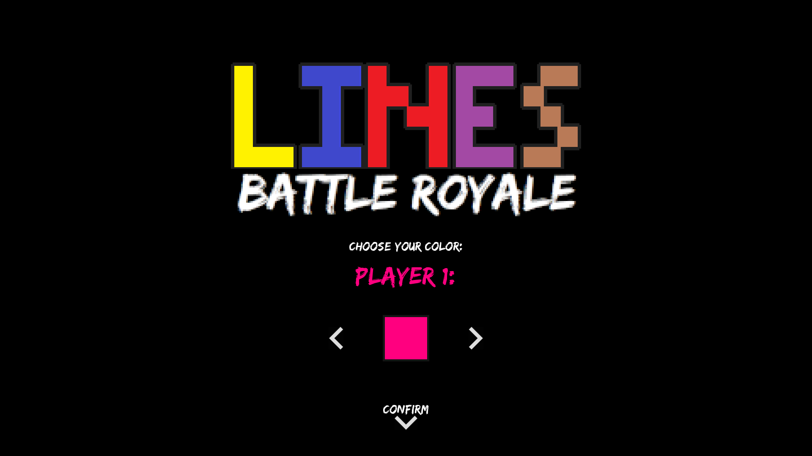
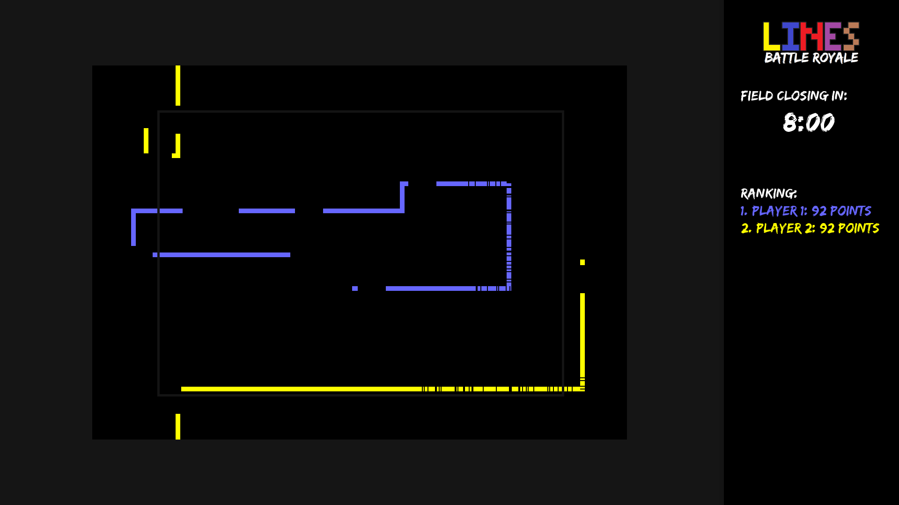
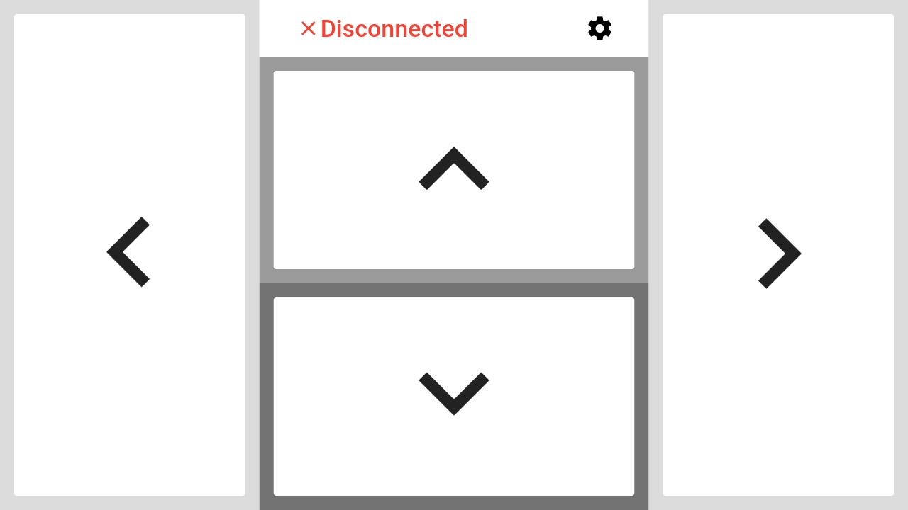
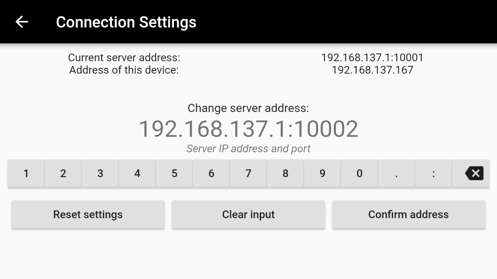

# Lines: Battle Royale
*Written on 27 Mar 2019.*

Multiplayer game with an app controller.

# Game (Server):
Writen in Python, using libraries: queue, pygame, socket, threading, time, random, sys and winsound.
The game is about being the last one moving on the field that is getting smaller every 10 seconds.
Number of players: 2-6 (this should be passed as the first argument when running the game), the default number is 2.
The game starts after all players connect and choose their colors and ends after one of the players scores more than 1000 points.

The server stores all incoming data in a separate thread-safe queue (one for each player) from which the main thread gets information needed to change movement directions.

 

  
  
  

# App (Client):
Written in Dart (using Flutter framework).
The app connects to the server after pressing "Disconnected" status, using the information available in the connection settings.

The app will display a snackbar when it encounters a connection error, but will try to connect to a port that is already used infinitely.
After connection it will send short string to the server whenever buttons are pressed (string like "UP", "DOWN", "RIGHT", "LEFT").
Whenever a button is pressed, the phone will vibrate (50ms for Android and 500ms for iOS).

In connection settings you can change server address to which the app will try to connect.
The IP address of your device is extracted when the app launches to avoid unnecessary threads running in the background.
The app will not connect properly without an IP address (because it is the first thing it sends to the server) so run the app after connecting to local network.

 

  
  

